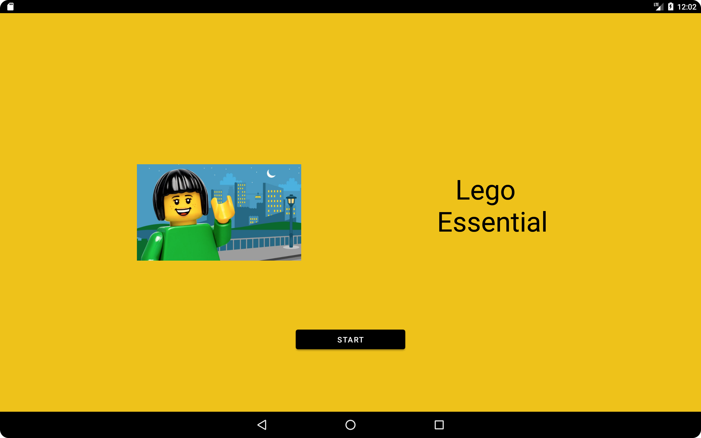
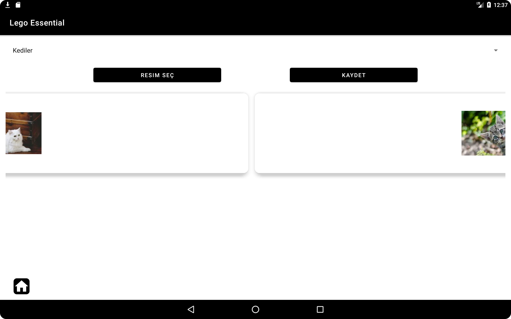
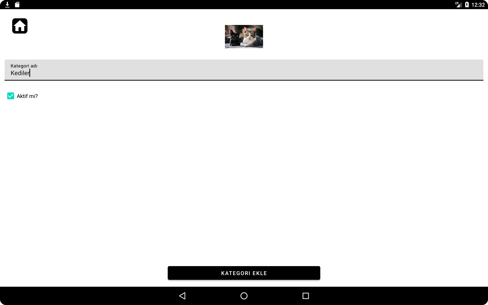
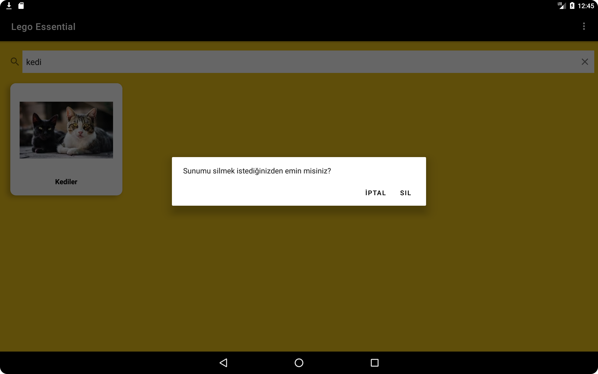
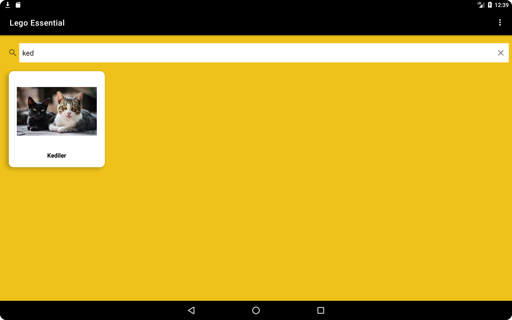
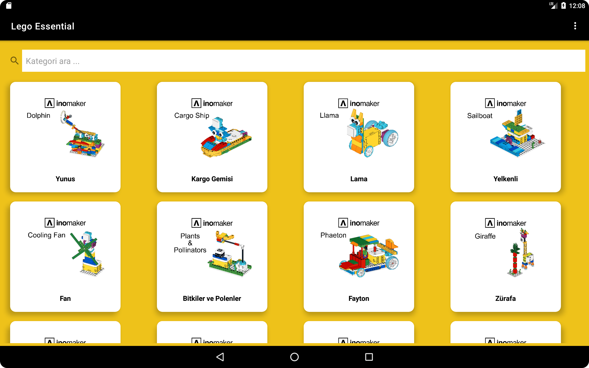
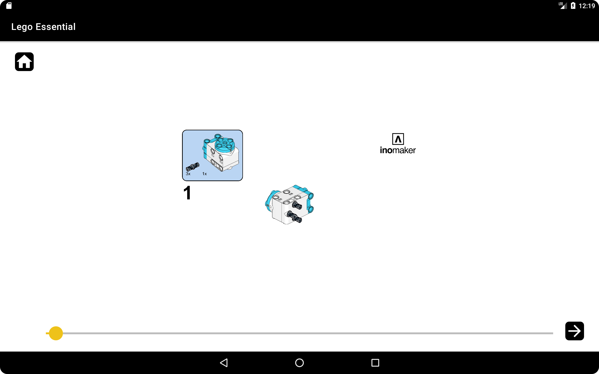
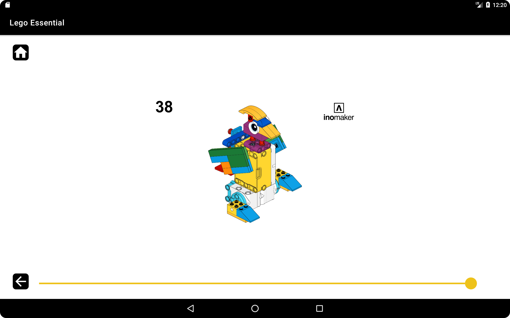

# 🤖 Lego Robotik Eğitim Uygulaması

Bu Android uygulaması, çocukların robotik eğitim sürecini adım adım görselleştirilmiş şekilde öğrenmelerini desteklemek amacıyla geliştirilmiştir. Uygulama, bir robotun oluşturulma adımlarını resimli sunumlar halinde sunar. Kullanıcılar sunumlar arasında gezinebilir, arama yapabilir ve robotların montaj süreçlerini kolayca takip edebilirler.

## 📱 Ekran Görüntüleri

### Başlangıç Ekranı


### Sunum Ekleme Ekranı


### Proje Oluşturma Ekranı


### Silme Onay Penceresi


### Proje Arama Ekranı


### Proje Seçim Ekranı


### Adım Adım Görüntüleme Ekranı


### Adım Adım Görüntüleme (Son Adım)



## 🚀 Özellikler

- 🔍 **Sunum Arama:** Proje adıyla hızlıca sunumları bulabilirsiniz.
- 🧩 **Adım Adım Gösterim:** Sunuma ait her bir adımı sırayla gezebilirsiniz.
- 📤 **Sunum Ekleme ve Silme (Admin):** Yalnızca şifre girilerek yapılabilir.
- ☁️ **Firebase Entegrasyonu:**
    - **Firestore** üzerinden sunum verileri,
    - **Firebase Storage** ile görseller saklanır.
- 📦 **MVVM Mimarisi & Repository Pattern:** Temiz ve sürdürülebilir yapı için kullanıldı.

## 🔒 Çocuk Kilidi & Güvenlik Özelliği

Uygulamada çocukların yalnızca sunumları görüntülemesi, ancak sunum **ekleme**, **düzenleme** veya **silme** gibi işlemleri yapamaması için bir güvenlik önlemi mevcuttur.

- 👤 **Yönetici işlemleri** için bir parola gereklidir.
- 🔐 Varsayılan parola: `1984`
- Parola yalnızca yönetimsel işlemler sırasında sorulur.

## 🛠️ Kurulum

1. **Projeyi klonlayın:**
    ```bash
    git clone https://github.com/kullaniciadi/LegoApp.git
    ```

2. **Android Studio ile açın.**

3. **Firebase yapılandırması:**
    - Kendi Firebase projenizi oluşturun.
    - `google-services.json` dosyasını oluşturun ve `app/` klasörünün içine yerleştirin.
    - Bu dosya güvenlik nedeniyle GitHub'a dahil edilmemiştir.

4. **Gradle bağımlılıkları otomatik olarak yüklenecektir.**

## 🧪 Kullanılan Teknolojiler

- Kotlin
- Firebase Firestore & Storage
- MVVM (Model-View-ViewModel)
- Glide (görsel yükleme için)
- Material Design bileşenleri

## 👨‍💻 Geliştirici

**Vedat Akcan**  
Bu proje, staj süreci kapsamında robotik eğitim içeriklerini desteklemek amacıyla geliştirilmiştir.
